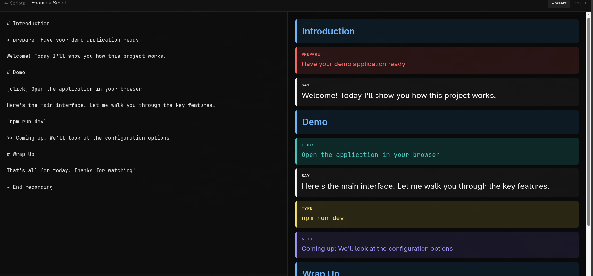
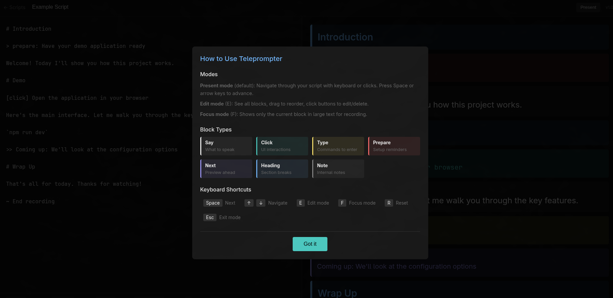
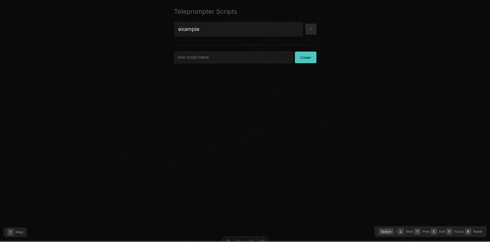

# Teleprompter
A simple teleprompter for video scripts with clear visual sections for different action types.

Scripts are stored in the browser and written in a simple markdown-like syntax. The editor shows your script source on the left and the rendered teleprompter view on the right.



Built-in help explains the different block types and keyboard shortcuts.






## Quick Start

```bash
cd ~/Work/teleprompter
bun run start     # Start server on port 3030
bun run dev       # Start with auto-reload
```

Open http://localhost:3030

## Script Format

Scripts are JSON files in `scripts/` directory:

```json
{
  "title": "My Video Script",
  "blocks": [
    { "type": "heading", "content": "Scene 1: Introduction" },
    { "type": "prepare", "content": "Have terminal open" },
    { "type": "say", "content": "Welcome to my video..." },
    { "type": "click", "content": "Open browser → Settings" },
    { "type": "type", "content": "docker compose up" },
    { "type": "next", "content": "Coming up: Demo time" },
    { "type": "note", "content": "Wait for process to complete" }
  ]
}
```

### Block Types

| Type | Purpose | Color |
|------|---------|-------|
| `say` | What to say (large, white) | White |
| `click` | What to click/interact with | Teal |
| `type` | Commands/text to type | Yellow |
| `prepare` | Setup before this section | Red |
| `next` | Preview of what's coming | Purple |
| `heading` | Section divider | Blue |
| `note` | Internal notes (not for speaking) | Gray |

## Keyboard Controls

| Key | Action |
|-----|--------|
| `Space` / `↓` / `→` | Next block |
| `↑` / `←` | Previous block |
| `F` | Toggle focus mode |
| `R` | Reset to beginning |
| `Home` | Jump to start |
| `End` | Jump to end |

## Agent/CLI Control

### List scripts
```bash
curl http://localhost:3030/api/scripts
```

### Get script content
```bash
curl http://localhost:3030/api/scripts/moas-demo
```

### Update script
```bash
curl -X PUT http://localhost:3030/api/scripts/my-script \
  -H "Content-Type: application/json" \
  -d '{"title": "New Script", "blocks": [...]}'
```

### Remote control (sends to all connected browsers)
```bash
# Next block
curl -X POST http://localhost:3030/api/scripts/moas-demo/control \
  -H "Content-Type: application/json" \
  -d '{"type": "next"}'

# Previous block
curl -X POST http://localhost:3030/api/scripts/moas-demo/control \
  -H "Content-Type: application/json" \
  -d '{"type": "prev"}'

# Jump to specific block (0-indexed)
curl -X POST http://localhost:3030/api/scripts/moas-demo/control \
  -H "Content-Type: application/json" \
  -d '{"type": "goto", "index": 5}'

# Reset to beginning
curl -X POST http://localhost:3030/api/scripts/moas-demo/control \
  -H "Content-Type: application/json" \
  -d '{"type": "reset"}'

# Toggle focus mode
curl -X POST http://localhost:3030/api/scripts/moas-demo/control \
  -H "Content-Type: application/json" \
  -d '{"type": "focus", "enabled": true}'
```

### File watching
The server watches `scripts/` for changes. Edit a JSON file and the browser auto-reloads.
